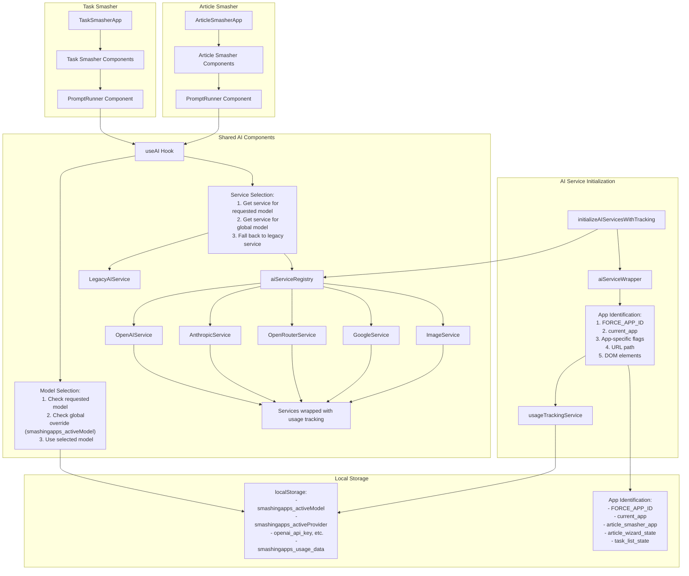
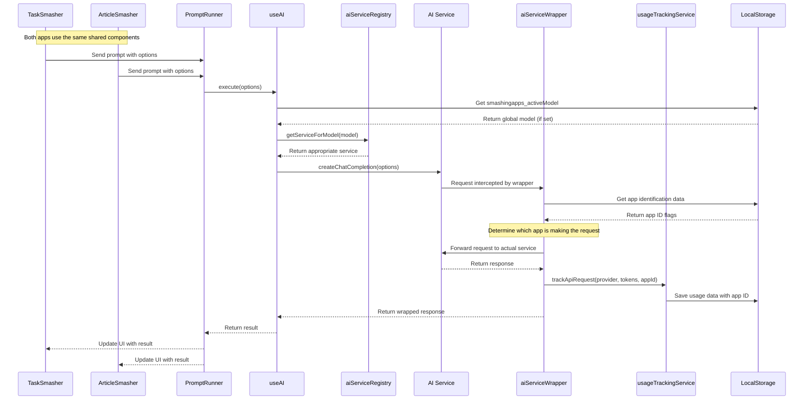
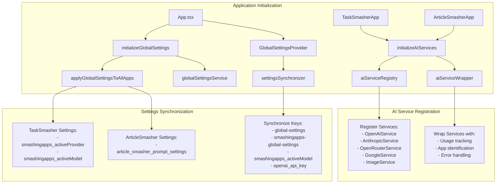
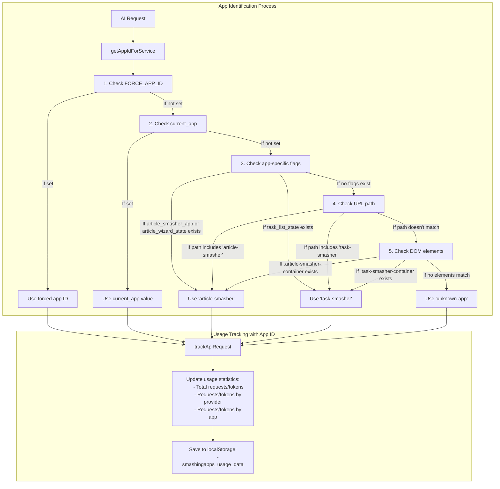
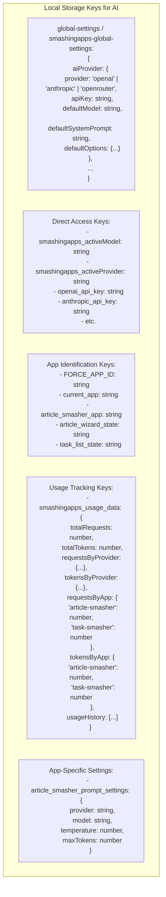
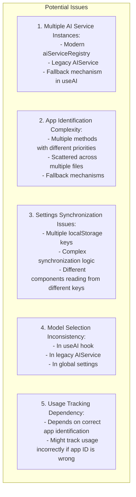
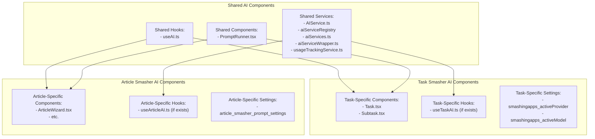

# SmashingApps AI Architecture

This document provides a detailed analysis of the AI components in the SmashingApps platform, focusing on how they are shared between Task Smasher and Article Smasher.

## 1. AI Components and Data Flow

## 2. AI Request Flow from Each App

## 3. AI Service Initialization and Sharing

## 4. App Identification for AI Usage Tracking

## 5. Local Storage Keys for AI Configuration

## 6. Potential Issues in AI Sharing

## 7. Shared vs. App-Specific AI Components

## Key Insights on AI Architecture

1. **Shared AI Infrastructure**: Both Task Smasher and Article Smasher use the same underlying AI infrastructure, including the service registry, hooks, and components.

2. **Dual AI Service Paths**: The system has both a modern path (using the registry pattern) and a legacy path (using a singleton service), which could lead to inconsistent behavior.

3. **Complex App Identification**: The system uses multiple methods to identify which app is making an AI request, with a complex fallback mechanism that could lead to misattribution.

4. **Settings Fragmentation**: AI settings are stored in multiple localStorage keys, with synchronization mechanisms that might not always work correctly.

5. **Usage Tracking Dependency**: Usage tracking depends on correct app identification, which might not always be reliable.

6. **Potential Solutions**:
   - Standardize on a single AI service architecture (either registry or singleton)
   - Simplify app identification with a more reliable mechanism
   - Consolidate settings into a single source of truth
   - Improve synchronization between apps
   - Add more robust error handling and logging