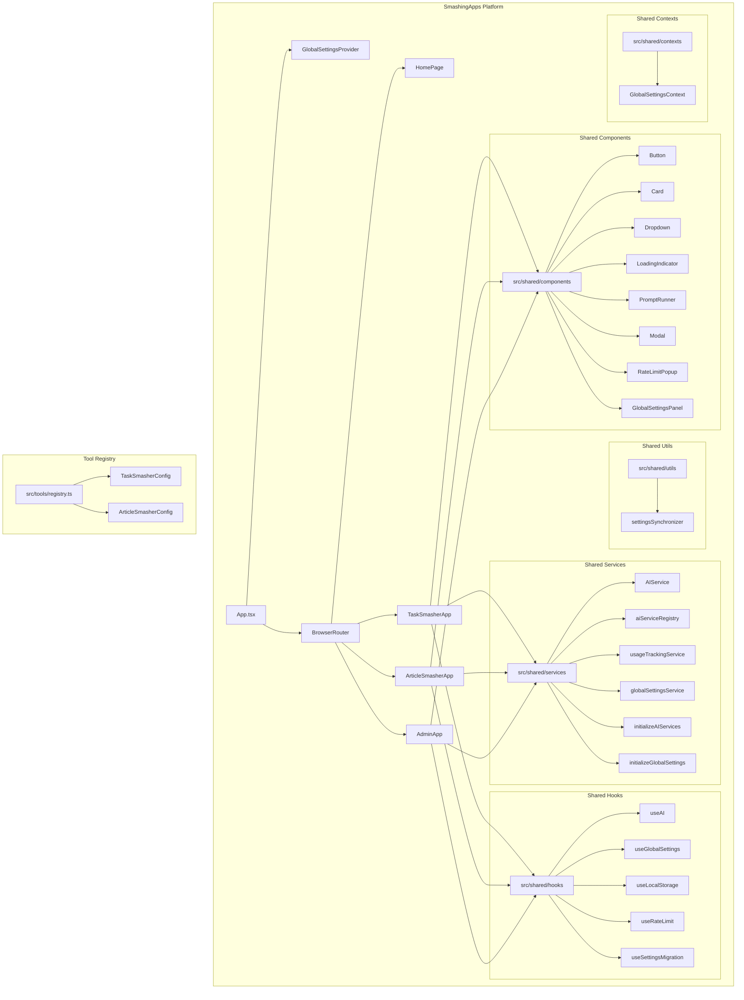
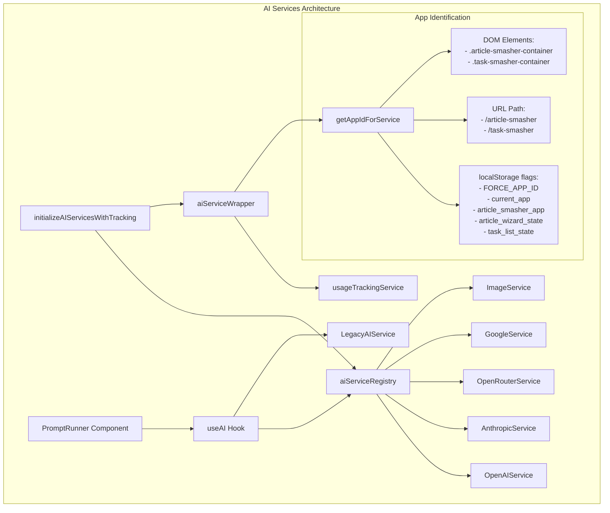

# SmashingApps Analysis Summary

## Overview

This document provides a summary of the architecture analysis and solution plan for the SmashingApps platform, focusing on the issues with AI components not being properly shared between Task Smasher and Article Smasher.

## Files Included

1. **[smashingapps-architecture.md](smashingapps-architecture.md)** - Overall platform architecture diagrams
2. **[smashingapps-detailed-architecture.md](smashingapps-detailed-architecture.md)** - Detailed AI component architecture diagrams
3. **[smashingapps-solution-plan.md](smashingapps-solution-plan.md)** - Comprehensive implementation plan
4. **[smashingapps-executive-summary.md](smashingapps-executive-summary.md)** - Concise summary of findings and recommendations

## Visual Diagrams

All the visual diagrams are included in the markdown files as Mermaid diagrams. To view these diagrams:

1. Open the markdown files in a markdown viewer that supports Mermaid diagrams (such as GitHub, GitLab, or VS Code with the Markdown Preview Mermaid Support extension)
2. The diagrams will automatically render as visual diagrams

For example, the following diagram from smashingapps-architecture.md shows the overall SmashingApps architecture:

And this diagram from smashingapps-detailed-architecture.md shows the AI components architecture:

## Key Findings

After a thorough examination of the codebase, I've identified five critical issues that are causing problems with the shared AI functionality:

1. **App Identification Conflicts**: Both apps aggressively set their own app identification flags and clear the other app's flags, with periodic refreshes every 5 seconds. This creates a race condition where the app that refreshed most recently "wins" the identification.

2. **Multiple Model Selection Paths**: There are multiple paths for model selection with different fallback mechanisms, leading to inconsistent model selection between apps.

3. **Settings Synchronization Issues**: Settings are stored in multiple localStorage keys with a complex synchronization mechanism that might not always work correctly.

4. **Usage Tracking Dependency**: Usage tracking depends on correct app identification, which is compromised by the app identification conflicts.

5. **Dual AI Service Paths**: The system has both a modern path (using the registry pattern) and a legacy path (using a singleton service), with inconsistent initialization between apps.

## Solution Approach

The solution focuses on creating a true "single source of truth" for AI services, settings, and app identification, while maintaining backward compatibility.

### Key Components of the Solution:

1. **Centralized App Registry**: A new service that provides a centralized way to register and identify apps without conflicts.

2. **Unified Settings Store**: A single source of truth for all settings with simplified synchronization.

3. **Standardized AI Service Initialization**: A consistent initialization process that ensures all apps use the same AI services.

4. **Enhanced Usage Tracking**: A tracking system that is independent of app identification conflicts.

5. **Updated App Components**: Modified Task Smasher and Article Smasher components that use the new centralized services.

## Next Steps

1. Review the detailed architecture diagrams in the markdown files
2. Review the comprehensive solution plan in smashingapps-solution-plan.md
3. Decide which phase of the implementation to prioritize
4. Begin implementation with the highest priority component

## Viewing Instructions

To get the best experience viewing these diagrams:

1. **VS Code**: Install the "Markdown Preview Mermaid Support" extension
2. **GitHub**: View the files directly on GitHub, which has built-in Mermaid support
3. **Mermaid Live Editor**: Copy the Mermaid code blocks to https://mermaid.live/ for interactive viewing
4. **Export as Images**: Use a tool like mermaid-cli to export the diagrams as PNG or SVG files