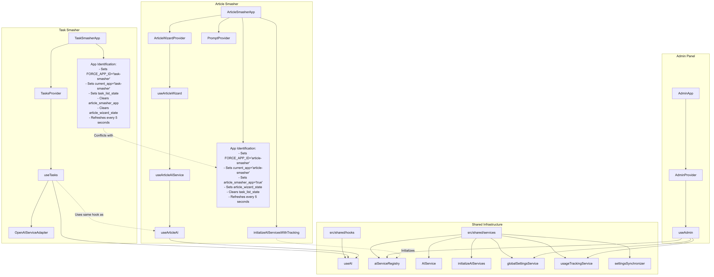
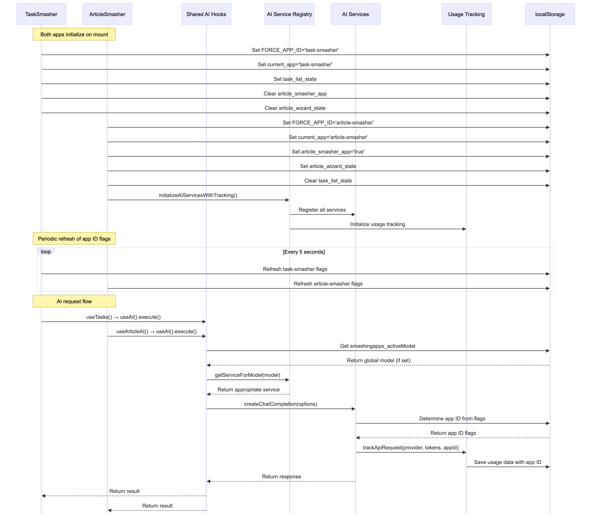
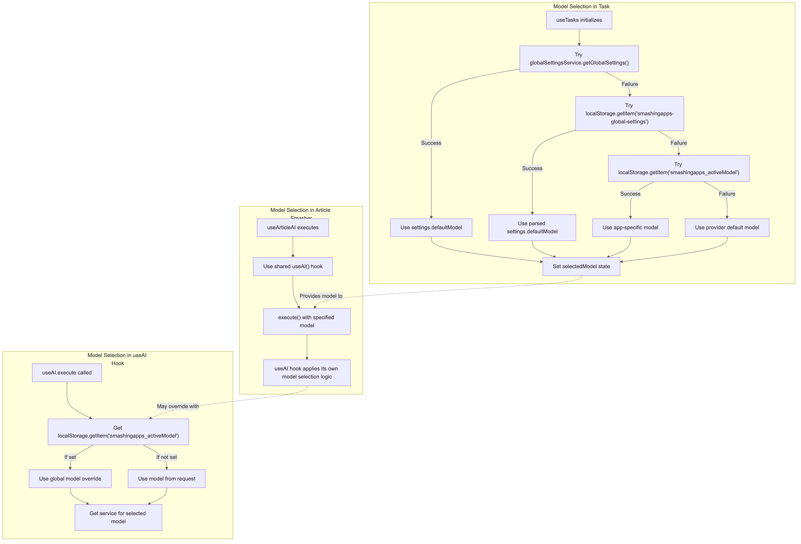
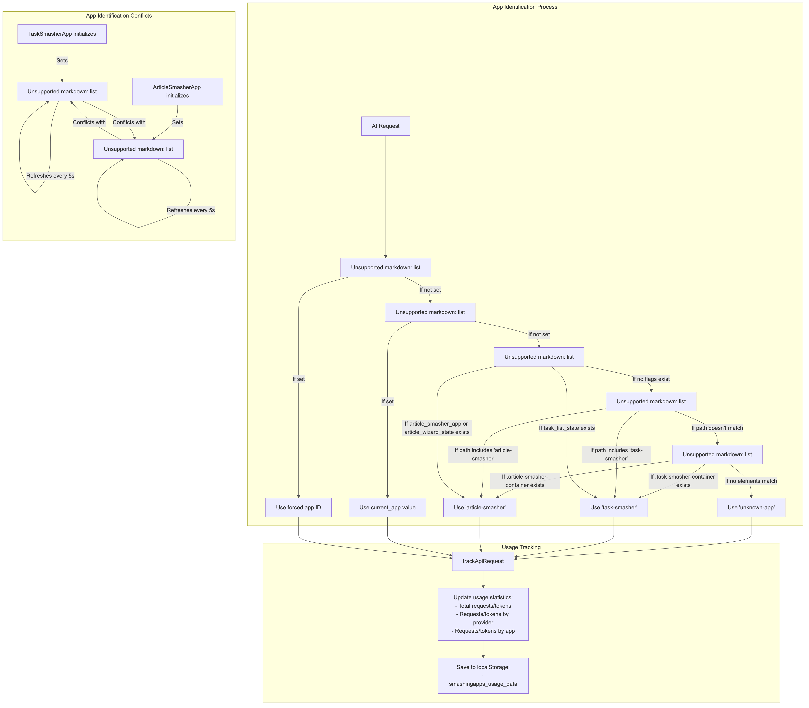
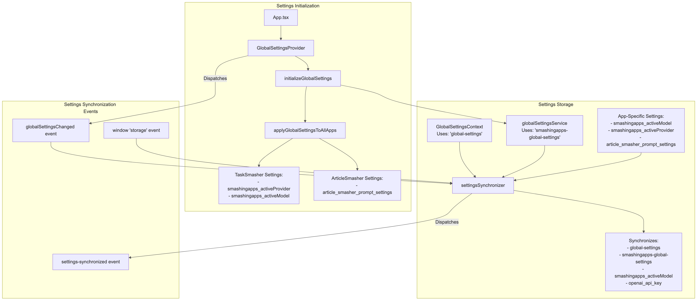

# SmashingApps Detailed Architecture Analysis

After a thorough examination of the codebase, this document provides a detailed analysis of the SmashingApps architecture, with a particular focus on how the AI components are shared between Task Smasher and Article Smasher.

## 1. Overall Architecture with App-Specific Implementations

## 2. AI Service Initialization and Usage Flow

## 3. Model Selection and Settings Flow

## 4. App Identification and Usage Tracking

## 5. Settings Management and Synchronization

## 6. Key Issues Identified

## 7. Summary of Findings

After a thorough examination of the codebase, I've identified several key issues that are likely causing the problems you're experiencing with the AI components not being properly shared between Task Smasher and Article Smasher:

1. **App Identification Conflicts**: Both apps aggressively set their own app identification flags and clear the other app's flags, with a periodic refresh every 5 seconds. This creates a race condition where the app that refreshed most recently "wins" the identification, causing inconsistent behavior.

2. **Multiple Model Selection Paths**: There are multiple paths for model selection with different fallback mechanisms:
   - Task Smasher tries global settings service, then localStorage global settings, then app-specific settings, then provider defaults
   - The shared useAI hook checks for a global model override in localStorage
   - This can lead to inconsistent model selection between apps

3. **Settings Synchronization Issues**: Settings are stored in multiple localStorage keys with a complex synchronization mechanism that might not always work correctly. Different components might read from different keys, leading to inconsistent settings.

4. **Usage Tracking Dependency**: Usage tracking depends on correct app identification, which is compromised by the app identification conflicts. Each app tries to ensure its own usage is tracked correctly, but this can lead to incorrect attribution.

5. **Dual AI Service Paths**: The system has both a modern path (using the registry pattern) and a legacy path (using a singleton service). Article Smasher explicitly calls `initializeAIServicesWithTracking()` while Task Smasher does not, which could lead to inconsistent initialization.

These issues combine to create a situation where the AI components are not truly shared between the apps in a consistent way, despite using the same underlying code. The aggressive app identification and periodic refreshes are particularly problematic, as they create a situation where the apps are effectively fighting for control of the shared resources.