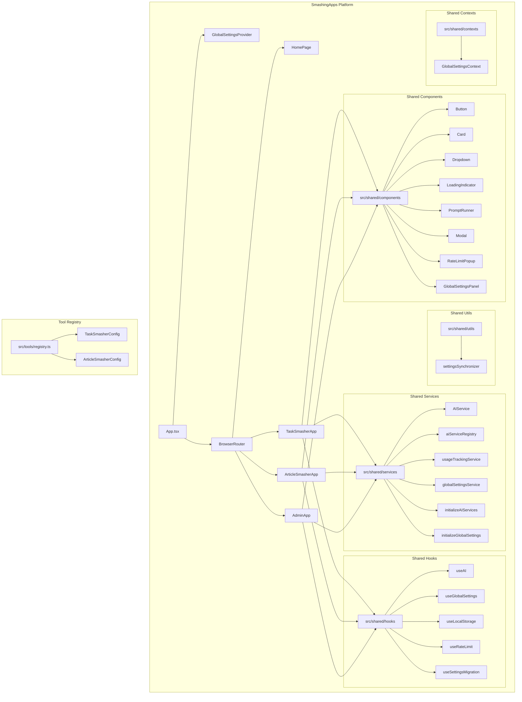
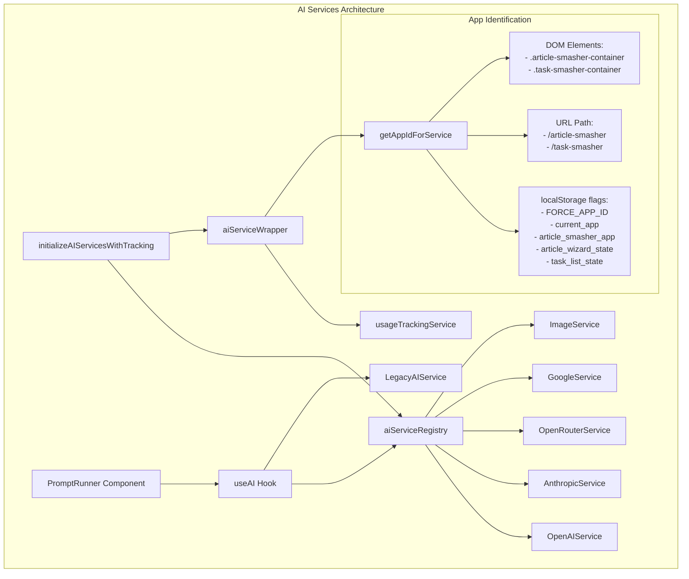
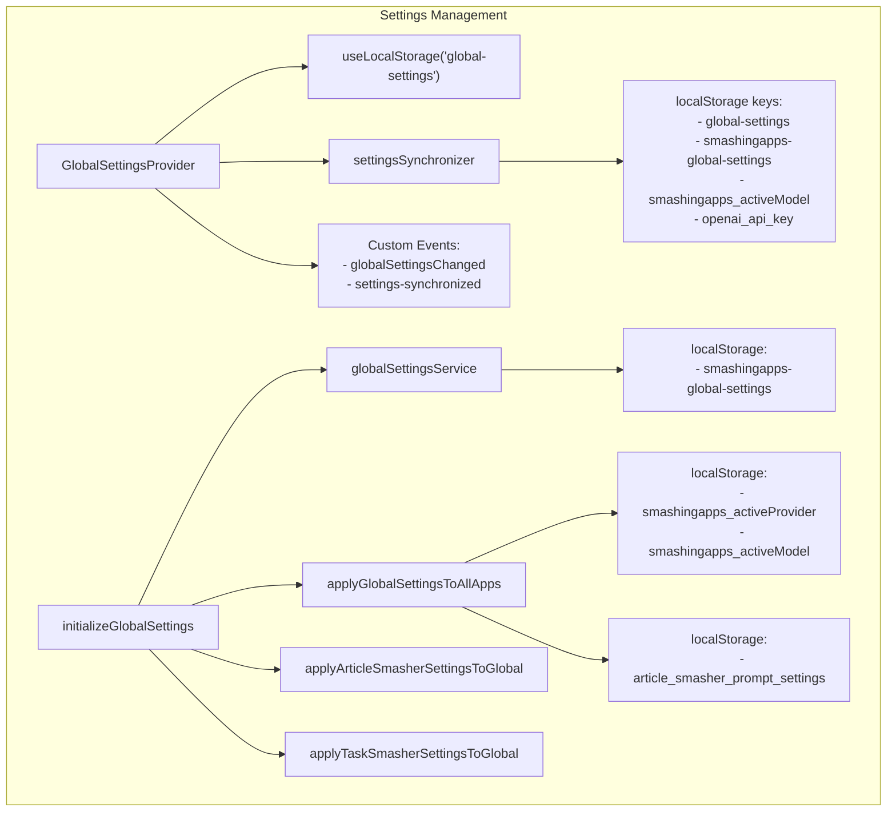
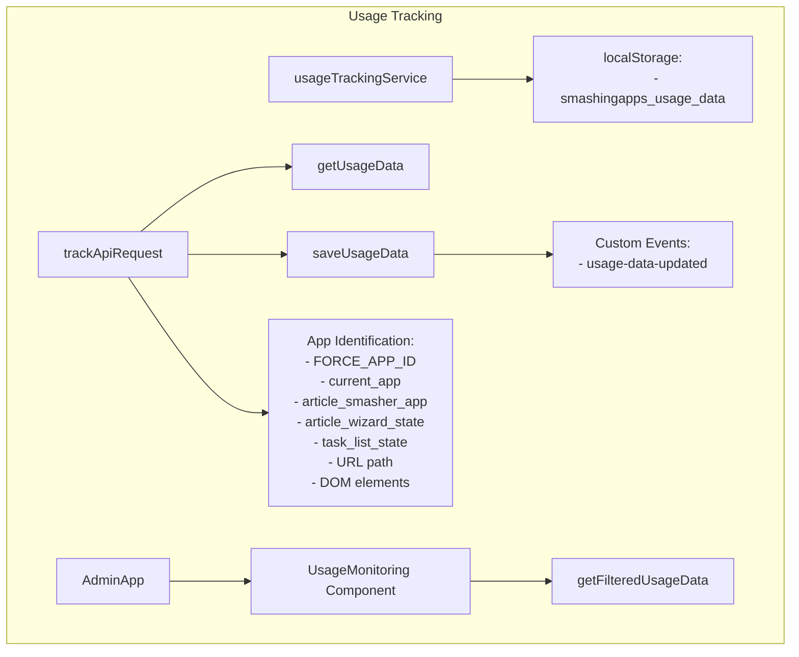
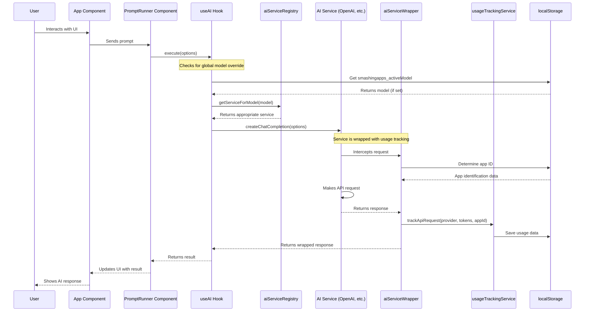
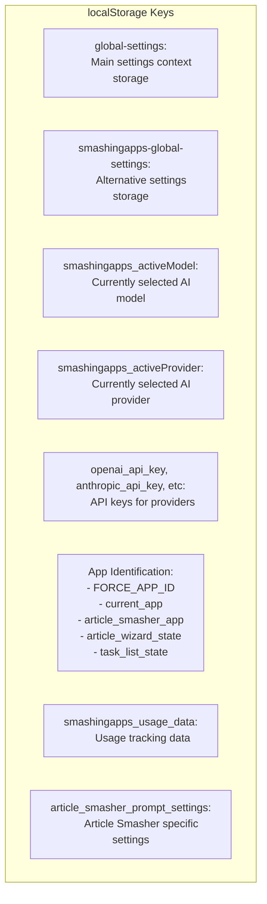

# SmashingApps Architecture Overview

This document provides a comprehensive architectural overview of the SmashingApps platform, with a particular focus on the AI components and how they interact with the rest of the system.

## 1. Overall SmashingApps Architecture

The SmashingApps platform consists of a main App component that provides global settings and routing to different applications:

- **HomePage**: The landing page for the platform
- **AdminApp**: The central administration panel for managing both Task Smasher and Article Smasher
- **TaskSmasherApp**: The Task Smasher application
- **ArticleSmasherApp**: The Article Smasher application

All applications share common components, services, hooks, utilities, and contexts from the `src/shared` directory. The Tool Registry manages the configuration for each tool.

## 2. AI Components Architecture

The AI components architecture consists of:

- **useAI Hook**: The main entry point for components to interact with AI services
- **aiServiceRegistry**: A registry of all available AI services
- **AI Services**: Implementations for different providers (OpenAI, Anthropic, etc.)
- **LegacyAIService**: A backward-compatibility service for older code
- **aiServiceWrapper**: Wraps AI services with usage tracking
- **App Identification**: Determines which app is making the AI request

The system has both modern and legacy paths for AI requests, with the modern path using the registry pattern and the legacy path using a singleton service.

## 3. Settings Management and Synchronization

The settings management system consists of:

- **GlobalSettingsProvider**: A React context provider for global settings
- **globalSettingsService**: A service for managing global settings
- **settingsSynchronizer**: Synchronizes settings between different localStorage keys
- **initializeGlobalSettings**: Initializes global settings and applies them to all apps
- **App-specific settings**: Each app has its own settings that can be synchronized with global settings

Settings are stored in multiple localStorage keys and synchronized between them to ensure consistency across the platform.

## 4. Usage Tracking System

The usage tracking system consists of:

- **usageTrackingService**: Tracks API usage across apps
- **trackApiRequest**: Records API requests with app identification
- **getUsageData/saveUsageData**: Manages usage data in localStorage
- **AppIdentification**: Determines which app is making the API request
- **UsageMonitoring**: Component in the AdminApp for monitoring usage

Usage tracking depends on correct app identification to attribute API requests to the right app.

## 5. Data Flow for AI Requests

The data flow for AI requests:

1. User interacts with a component that uses the PromptRunner component
2. PromptRunner calls the useAI hook's execute method
3. useAI checks for a global model override in localStorage
4. useAI gets the appropriate service from the aiServiceRegistry
5. The service (wrapped with usage tracking) makes the API request
6. The wrapper determines the app ID and tracks usage
7. The response is returned to the component and displayed to the user

This flow shows how AI requests are processed and how usage is tracked.

## 6. Local Storage Usage

The platform uses multiple localStorage keys for different purposes:

- **Settings storage**: global-settings, smashingapps-global-settings
- **AI configuration**: smashingapps_activeModel, smashingapps_activeProvider, API keys
- **App identification**: FORCE_APP_ID, current_app, app-specific flags
- **Usage tracking**: smashingapps_usage_data
- **App-specific settings**: article_smasher_prompt_settings

This complex localStorage usage requires careful synchronization to ensure consistency across the platform.

## Key Insights

1. **Shared Architecture**: The platform uses a shared architecture with common components, services, and hooks.

2. **AI System**: The AI system uses a registry pattern with multiple service implementations and a legacy fallback system.

3. **App Identification**: There's a complex app identification system using multiple methods (localStorage flags, URL path, DOM elements).

4. **Settings Management**: Settings are stored in multiple localStorage keys with synchronization mechanisms.

5. **Usage Tracking**: Usage tracking depends on correct app identification to attribute API requests to the right app.

6. **Potential Issues**:
   - Multiple AI service instances (modern registry and legacy service)
   - Complex app identification that might lead to inconsistent behavior
   - Settings synchronization complexity
   - Model selection happening in multiple places
   - Usage tracking depending on correct app identification