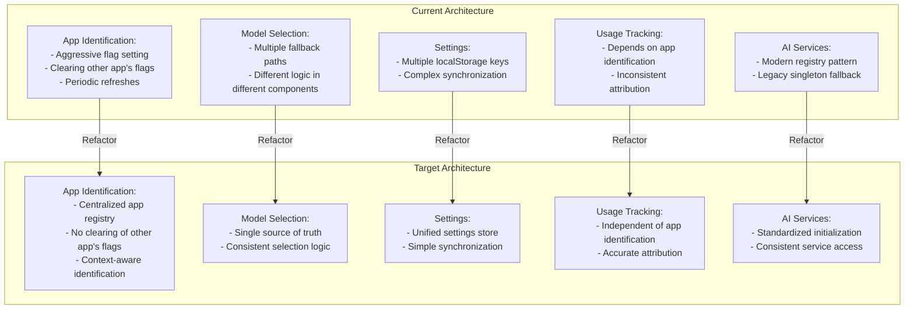

# SmashingApps Solution Plan

Based on the detailed architecture analysis, this document outlines a comprehensive plan to address the issues with the AI components not being properly shared between Task Smasher and Article Smasher.

## 1. Problem Summary

The core issues preventing proper sharing of AI components between Task Smasher and Article Smasher are:

1. **App Identification Conflicts**: Both apps aggressively set their own app identification flags and clear the other app's flags.
2. **Multiple Model Selection Paths**: Inconsistent model selection due to multiple fallback mechanisms.
3. **Settings Synchronization Issues**: Settings stored in multiple localStorage keys with complex synchronization.
4. **Usage Tracking Dependency**: Usage tracking depends on correct app identification, which is compromised.
5. **Dual AI Service Paths**: Both modern and legacy AI service paths with inconsistent initialization.

## 2. Solution Approach

The solution will focus on creating a true "single source of truth" for AI services, settings, and app identification, while maintaining backward compatibility.



## 3. Implementation Plan

### Phase 1: Create Centralized App Registry

Create a new `AppRegistry` service that provides a centralized way to register and identify apps without conflicts.

Key features:
- Single source of truth for app identification
- No clearing of other app's flags
- Context-aware identification based on multiple factors
- Backward compatibility with existing app identification mechanisms

### Phase 2: Unify Settings Management

Create a unified settings store that serves as the single source of truth for all settings.

Key features:
- Single localStorage key for all settings
- Migration from legacy settings
- Synchronization with legacy settings for backward compatibility
- Simplified API for accessing and updating settings

### Phase 3: Standardize AI Service Initialization

Create a standardized AI service initialization process that ensures consistent behavior across apps.

Key features:
- One-time initialization at the application root level
- Consistent configuration of all AI services
- Integration with the centralized app registry
- Integration with the unified settings store

### Phase 4: Improve Usage Tracking

Modify the usage tracking service to be independent of app identification conflicts.

Key features:
- Integration with the centralized app registry
- Migration from legacy usage data
- Accurate attribution of usage to the correct app
- Simplified API for tracking and querying usage data

### Phase 5: Update App Components

Update the Task Smasher and Article Smasher components to use the new centralized services.

#### Task Smasher Updates:
```typescript
// src/tools/task-smasher/TaskSmasherApp.tsx
import { appRegistry } from '../../shared/services/appRegistry';
import { initializeAIServices } from '../../shared/services/aiServiceInitializer';

const TaskSmasherApp: React.FC = () => {
  // Use the centralized app registry
  useEffect(() => {
    // Register the app once on mount
    appRegistry.registerApp('task-smasher');
    
    // Initialize AI services if not already initialized
    initializeAIServices();
    
    // No need for periodic refreshes or clearing other app's flags
  }, []);
  
  // Rest of the component...
};
```

#### Article Smasher Updates:
```typescript
// src/tools/article-smasher/ArticleSmasherApp.tsx
import { appRegistry } from '../../shared/services/appRegistry';
import { initializeAIServices } from '../../shared/services/aiServiceInitializer';

const ArticleSmasherApp: React.FC = () => {
  // Use the centralized app registry
  useEffect(() => {
    // Register the app once on mount
    appRegistry.registerApp('article-smasher');
    
    // Initialize AI services if not already initialized
    initializeAIServices();
    
    // No need for periodic refreshes or clearing other app's flags
  }, []);
  
  // Rest of the component...
};
```

#### useAI Hook Updates:
```typescript
// src/shared/hooks/useAI.ts
import { unifiedSettings } from '../services/unifiedSettings';

export function useAI(): UseAIReturn {
  // Use the unified settings for model selection
  const execute = useCallback(async (options: AIExecuteOptions): Promise<AIExecuteResult> => {
    // Get the model from unified settings if not specified
    const aiSettings = unifiedSettings.getAISettings();
    const modelToUse = options.model || aiSettings.model;
    
    // Rest of the function...
  }, []);
  
  // Rest of the hook...
}
```

### Phase 6: Update Admin Panel

Update the admin panel to use the new centralized services for managing settings and viewing usage data.

```typescript
// src/admin/contexts/AdminContext.tsx
import { unifiedSettings } from '../../shared/services/unifiedSettings';
import { enhancedUsageTracking } from '../../shared/services/enhancedUsageTracking';

export const AdminProvider: React.FC<{children: ReactNode}> = ({ children }) => {
  // Use the unified settings
  const [settings, setSettings] = useState(unifiedSettings.getSettings());
  
  // Use the enhanced usage tracking
  const [usageStats, setUsageStats] = useState(enhancedUsageTracking.getUsageData());
  
  // Update settings
  const updateSettings = (newSettings: Partial<UnifiedSettings>) => {
    const updated = unifiedSettings.updateSettings(newSettings);
    setSettings(updated);
  };
  
  // Rest of the component...
};
```

## 4. Migration Strategy

To ensure a smooth transition to the new architecture, we'll follow these steps:

1. **Implement New Services**: Develop and test the new centralized services without modifying existing code.

2. **Create Adapters**: Implement adapter layers that allow the new services to work with existing code.

3. **Gradual Migration**: Update one app at a time, starting with Task Smasher, then Article Smasher, and finally the Admin Panel.

4. **Backward Compatibility**: Maintain backward compatibility with legacy settings and usage data throughout the migration.

5. **Testing**: Thoroughly test each phase of the migration to ensure that both apps continue to function correctly.

6. **Cleanup**: Once all components have been migrated, remove the legacy code and adapters.

## 5. Expected Outcomes

After implementing this solution, we expect the following outcomes:

1. **Consistent AI Behavior**: Both Task Smasher and Article Smasher will use the same AI services with consistent configuration.

2. **Accurate Usage Tracking**: Usage will be correctly attributed to the appropriate app, regardless of which app was used most recently.

3. **Simplified Settings Management**: Settings will be stored in a single location with a simple API for access and updates.

4. **Improved Maintainability**: The codebase will be more maintainable with clear separation of concerns and reduced duplication.

5. **Better User Experience**: Users will have a consistent experience across both apps, with settings and preferences persisting correctly.

## 6. Implementation Timeline

1. **Phase 1 (App Registry)**: 1-2 days
2. **Phase 2 (Unified Settings)**: 2-3 days
3. **Phase 3 (AI Service Initialization)**: 1-2 days
4. **Phase 4 (Usage Tracking)**: 2-3 days
5. **Phase 5 (App Updates)**: 3-4 days
6. **Phase 6 (Admin Panel)**: 2-3 days
7. **Testing and Refinement**: 3-5 days

Total estimated time: 2-3 weeks
